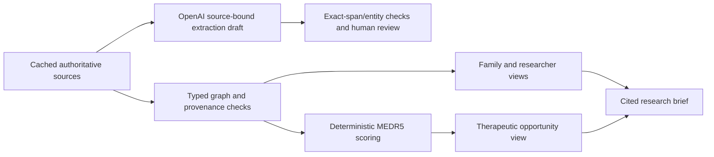

# Architecture

## Boundaries

`run.py` serves a loopback HTTP API and the vanilla browser UI using only the Python standard library. Startup validates all four pilot graphs. `atlas/data.py` loads the public cached snapshot and inherited GARD catalog. `atlas/graph.py` builds typed, cited nodes/edges; `atlas/api.py` assembles product views; `atlas/briefs.py` exports reviewable cited text. `atlas/graph_reasoning.py` projects typed causal/mechanism/spillover edges into numerical inputs, retains the consumed edge IDs and fails closed when any required relationship is removed. Product ranking, comparison, add-on and surrogate analysis use these graph projections; remaining biology and next experiments use the gated primary result. `atlas/core.py` imports the original scoring helper by file path to avoid initializing unrelated legacy engines. `atlas/ai.py` handles proposal-only extraction.

LLM drafts have no automatic promotion route. The cited graph is curated code/data. Human semantic and experimental review remains necessary even when an exact span validates.

## Deterministic reasoning policy

The original helper supplies direction alignment and additive/overlap calculations. This adapter explicitly gates unknown directions instead of using the legacy helper's partial-credit fallback.

- Deficiency/down/LOF + restore/activate: +1 alignment.
- Excess/up/GOF + inhibit: +1 alignment.
- Opposite effect: -0.85; an opposed covered axis blocks eligibility.
- Coverage: weights of favorably matched, cited axes divided by all curated signature weights. Invalid/missing signature evidence blocks the entire candidate rather than shrinking the denominator.
- Priority: normalized signed coverage minus 0.22 per unique cited off-signature mechanism minus evidence uncertainty. Signed raw score and wrong-way penalty come from the preserved helper.
- Uncertainty: best supported evidence weight per matched causal effect, averaged across matched effects. Animal .30; preclinical cells .25; human cells .15; observational .20; randomized trial .05; review .35; other .50. These are explicit uncalibrated policy weights. A stronger irrelevant effect cannot dilute causal uncertainty.
- Eligibility: known causal direction, sourced effects, at least one causal match, no opposed axis, positive priority and no explicitly unknown/invalid spillover record. Every inventory is incomplete; absence of recorded spillover does not establish selectivity. A computable priority is only a research-ordering heuristic.
- Add-on: eligible direction/evidence, a newly closed curated axis, net gain above .05 after original redundancy and spillover penalties. No demo bundle passes. Unknown spillover add-ons are withheld.
- Risk: sourced context-specific label warnings, or unknown. Quantitative burden is `null`, not zero. Risk never derives from gene coverage, LLM output or combination arithmetic.
- Remaining deviation: uncovered curated targets plus explicitly retained unmodeled biology. Full coverage of one UBE3A axis cannot remove functional rescue, timing, delivery or deletion-context gaps.
- Surrogates: overlap/divergence is experimental context, not therapeutic equivalence; propose cellular comparisons with controls and falsifiers, never patient self-experimentation.

The demo topotecan priority is 1 - .22 - .15 = .63. This is not a drug potency, response probability or clinical safety score. Research comparators are kept separate from existing-medicine repurposing candidates.

## Evidence and graph

Types: Disease, Gene, Variant, Phenotype, Study, Patient Group, Trial, Drug, Intervention, Pathway, Experiment, Asset and Research Team. Variant nodes describe mechanism/dosage classes, not individual patient HGVS calls. Every item resolves source IDs to URL, retrieval date, source evidence type/level and contextual confidence. Categories are FACT (source-reported), INFERENCE, HYPOTHESIS or CLINICAL EVIDENCE (trial-sourced); these categories do not convert a reported association to causal certainty. Contradictory-evidence fields report incomplete phenotype rescue where sourced and explicitly state that contradiction review is not systematic elsewhere.

The hero cluster shares imprinting assays and a published paired model approach. Prader-Willi is complex, often multigene, and is not classified as an equivalent monogenic UBE3A deficiency. The dosage-gain counterexample is excluded from the restoration therapeutic cluster. Neither neighbor acquires Angelman drug rankings.

## OpenAI use

Development: OpenAI Codex assisted curated evidence extraction, relation drafts, plain-language explanation and experimental-question drafting. This work was source-inspected during implementation, not independently clinically reviewed.

Runtime: explicit UI request → backend Responses API → strict JSON schema with allowed node/source/predicate enums → exact-span and entity validation → proposal-only display. `store:false`, bounded output and timeout; no key in the frontend. Only the selected public excerpt/summary and allowed entity IDs are sent. Failure/refusal/unsupported output yields no claim. Tests mock Responses transport; these are adapter tests, not live API proof. Live use requires an available server-side key and model access. Local LLM alternative is similarly gated. Offline replay displays the saved draft with an honest mode label.

Official API references: https://developers.openai.com/api/docs/guides/structured-outputs and https://developers.openai.com/api/docs/models/gpt-4.1-mini (checked 2026-10-03).

## Scale beyond the pilot

Discovery indexes inherited names without promising curated mechanisms. Extension requires ingesting licensed authoritative records, ontology/synonym reconciliation, allele/variant-specific direction evidence, source-bound extraction, human semantic review, contradiction/context review, versioned graph storage and regression scoring checks. Current JSON and in-memory graph are prototype stores; production scale would require indexed storage, incremental ingestion and access governance. Four pilots and one deep journey do not establish 5,000-disease coverage. No unsupported rankings are fabricated to fill the breadth gap.

## Local operation

Loopback only, no accounts/database/patient data. Static traversal checks, same-origin POST checks, bounded extraction payloads, no automatic outgoing actions. Production deployment, authentication, consent and patient-data governance are outside this local prototype. Original MEDR5 UI and engines remain preserved on the baseline branch/tag.

## Separate prior and frequent-flyer policy

`atlas/priors.py` provides an explicitly disease-specific cited direct-pair evidence prior: preclinical mechanism observation .30; clinical symptom RCT .80; absent evidence unknown. These are ordinal evidence policy values, not calibrated treatment probabilities. The prior never adds to mechanistic fit or overrides a missing causal direction. Ganaxolone/CDKL5 illustrates a positive clinical symptom prior with a withheld causal-restoration score.

For ranking eligible repurposing hypotheses, positive priority is divided by sqrt(max(1, distinct cited local disease associations)). Raw mechanistic score remains separately displayed; negative scores cannot improve through normalization. Duplicate pair records and uncited links do not inflate degree. All real pilot candidates currently have one recorded association, so this correction does not change their ordering. A four-link synthetic regression case halves priority; it is not a biomedical assertion. Recorded target breadth remains informational: the established MEDR5 spillover penalty already handles off-signature/polypharmacological breadth. The local degree inventory is incomplete and cannot establish drug selectivity.

Inspired by Every Cure's discussion of frequent-flyer bias and held-out evaluation, not an implementation of MATRIX's trained predictions or rank-quantile transformation. No embedding or ML pipeline was added. Primary technical references (checked 2026-10-03): [Every Cure normalization](https://docs.dev.everycure.org/pipeline/pipeline_steps/matrix_transformation/) and [evaluation](https://docs.dev.everycure.org/pipeline/data_science/evaluation_deep_dive/).

`atlas/benchmark.py` withholds each direct positive pair from its prior and does not prefilter candidates using positive disease memberships. Relation-only ablation retains source-derived mechanistic information, so it is explicitly leakage-prone. Source-disjoint ablation also strips held sources from all scored effect/spillover/risk records and reveals abstention. Results are stratified into preclinical and clinical symptom evidence; see BENCHMARK_REPORT.md.
